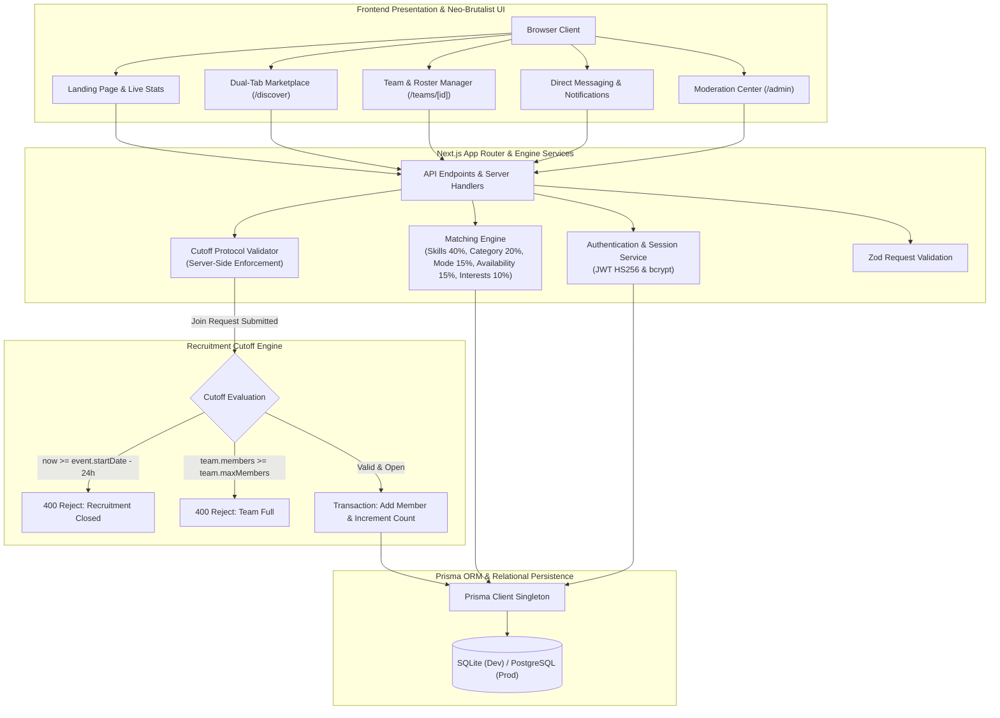

<div align="center">

# TeamOrphan

### Last-Minute Event Teammate Matching Platform with 24-Hour Recruitment Cutoff Protocol

<br/>

<div align="center">
    <a href="https://team-orphan.vercel.app/">Live Demo</a> •
    <a href="#quick-start">Quick Start</a> •
    <a href="#key-features">Key Features</a> •
    <a href="#architecture">Architecture</a> •
    <a href="#24-hour-recruitment-protocol">24-Hour Protocol</a> •
    <a href="#matching-algorithm">Matching Engine</a> •
    <a href="#deployment">Deployment</a>
</div>

<br/>

A full-stack, neo-brutalist web application designed for students, developers, competitive programmers, and participants in hackathons, esports, robotics arenas, and college activities. TeamOrphan connects incomplete teams with available talent and enforces a strict, server-verified 24-hour recruitment freeze before event kickoff.

**Live Application**: [https://team-orphan.vercel.app/](https://team-orphan.vercel.app/)

<br/>

[](https://team-orphan.vercel.app/)
[](https://nextjs.org/)
[](https://www.typescriptlang.org/)
[](https://reactjs.org/)
[](https://tailwindcss.com/)
[](https://www.prisma.io/)
[](https://www.postgresql.org/)
[](https://zod.dev/)
[](LICENSE)

</div>

<br/>

---

## Architecture



---

## Key Features

<table>
<tr>
<td width="50%" valign="top">

### 24-Hour Recruitment Cutoff Protocol
Enforces recruitment closures when an event is less than 24 hours away. Client components provide real-time reactive countdowns and urgency badges, while server-side request handlers strictly reject unauthorized submissions after the cutoff timestamp.

</td>
<td width="50%" valign="top">

### Weighted Compatibility Engine
Calculates deterministic 0-100% compatibility scores between candidates and squads based on required/preferred skills (40%), event domain (20%), mode and location (15%), availability (15%), and shared interests (10%).

</td>
</tr>
<tr>
<td width="50%" valign="top">

### Dual-Tab Marketplace
Facilitates two-way discovery with dedicated tabs for teams seeking specific roles (e.g. 3/4 filled) and individual builders posting availability profiles with skill tags, bios, and experience highlights.

</td>
<td width="50%" valign="top">

### Team Lifecycle & Join Requests
Interactive join pitch modal with team leader management controls. Team leaders can review candidate profiles, accept or reject applicants, and have listings automatically locked when max capacity is reached.

</td>
</tr>
<tr>
<td width="50%" valign="top">

### Direct Messaging & Alerts
In-app direct messaging system allowing recruiters and candidates to coordinate logistics directly, backed by real-time notification feeds for requests, approvals, and urgency warnings.

</td>
<td width="50%" valign="top">

### Trust & Moderation Suite
Protected admin interface for reviewing community reports, moderating listings, and toggling user suspensions to maintain a safe and spam-free platform.

</td>
</tr>
</table>

---

## 24-Hour Recruitment Protocol

The 24-hour cutoff rule prevents last-second team reorganization and ensures squads are locked before competition day.

```text
[ Event Kickoff - 48h ] ----------> [ Event Kickoff - 24h ] ----------> [ Event Kickoff ]
       Status: OPEN                         Status: CLOSED                    Status: ACTIVE
    Recruitment Active                   Recruitment Frozen                 Event in Progress
```

### Protocol Invariants
1. **Freeze Window Calculation**: Cutoff Timestamp = `event.startDate - (24 * 60 * 60 * 1000)`.
2. **Server-Side Guard**: Every call to `/api/teams/join-request` executes `checkRecruitmentAllowed()`. If the server clock exceeds the cutoff timestamp, the request is rejected with HTTP 400.
3. **Capacity Guard**: When accepted members equal `team.maxMembers`, `team.status` automatically updates to `FULL` and remaining open slots are locked.

---

## Matching Algorithm

Compatibility scores are calculated using a weighted multi-factor formula:

$$\text{Score} = S_{\text{skills}} (40\%) + C_{\text{category}} (20\%) + L_{\text{location/mode}} (15\%) + A_{\text{availability}} (15\%) + I_{\text{interests}} (10\%)$$

```typescript
// Core factor distribution
const SKILL_WEIGHT = 0.40;
const CATEGORY_WEIGHT = 0.20;
const LOCATION_MODE_WEIGHT = 0.15;
const AVAILABILITY_WEIGHT = 0.15;
const INTERESTS_WEIGHT = 0.10;
```

---

## Project Structure

```text
TeamOrphan/
├── app/
│   ├── (auth)/
│   │   ├── login/page.tsx           # Authentication login
│   │   └── register/page.tsx        # Registration with interactive tag inputs
│   ├── admin/page.tsx               # Protected platform moderation dashboard
│   ├── create/
│   │   ├── orphan/page.tsx          # Post availability profile
│   │   └── team/page.tsx            # Post team requirement listing
│   ├── dashboard/page.tsx           # User command center and match feed
│   ├── discover/page.tsx            # Dual-tab marketplace with filters
│   ├── events/
│   │   ├── [id]/page.tsx            # Event details, countdown, teams roster
│   │   └── page.tsx                 # Events directory
│   ├── messages/page.tsx            # Direct messaging chat interface
│   ├── notifications/page.tsx       # In-app notifications feed
│   ├── profile/[username]/page.tsx  # Builder public profile
│   ├── teams/
│   │   ├── [id]/page.tsx            # Team roster, empty slots, leader manager
│   │   └── page.tsx                 # Teams directory
│   ├── api/                         # REST handlers for auth, teams, requests, admin
│   ├── globals.css                  # Neo-brutalist theme definitions
│   └── layout.tsx                   # Root layout, fonts, navigation, footer
├── components/
│   ├── cards/                       # TeamCard, OrphanCard, EventCard
│   ├── modals/                      # JoinRequestModal, ReportModal, MessageModal
│   ├── navbar/                      # Sticky brutalist navbar with alerts
│   └── ui/                          # BrutalButton, BrutalCard, Countdown, MatchScore
├── lib/
│   ├── auth.ts                      # JWT and session management
│   ├── cutoff.ts                    # 24-hour protocol validator
│   ├── db.ts                        # Prisma client singleton
│   ├── matching.ts                  # Compatibility scoring engine
│   └── validation.ts                # Zod schemas
├── prisma/
│   ├── schema.prisma                # Relational schema
│   ├── seed.js                      # Seed data script
│   └── clean.js                     # Database reset script
├── package.json
└── README.md
```

---

## Quick Start

### 1. Prerequisites
- Node.js 18.0 or higher
- npm, pnpm, or yarn

### 2. Installation
```bash
git clone https://github.com/pprbkt/TeamOrphan.git
cd TeamOrphan
npm install
```

### 3. Environment Configuration
Create a `.env` file in the root directory:
```env
DATABASE_URL="file:./dev.db"
JWT_SECRET="your_secure_jwt_secret_key_change_in_production"
NODE_ENV="development"
NEXT_PUBLIC_APP_URL="http://localhost:3000"
```

### 4. Database Setup
```bash
# Push schema to SQLite
npx prisma db push

# Optional: Seed sample events and teams for testing
npm run db:seed

# Optional: Purge database to clean state
npm run db:clean
```

### 5. Start Development Server
```bash
npm run dev
```
Open [http://localhost:3000](http://localhost:3000) in your browser.

---

## Production Build

```bash
# Compile and optimize production bundle
npm run build

# Start production server
npm run start
```

---

## Deployment

### Vercel Deployment with PostgreSQL
1. Push the repository to GitHub.
2. Import the repository into [Vercel](https://vercel.com).
3. Connect a cloud PostgreSQL instance (Vercel Postgres / Neon / Supabase).
4. Update `provider = "postgresql"` in `prisma/schema.prisma`.
5. Set `DATABASE_URL` in Vercel Environment Variables.
6. Trigger deployment.

---

## License

This project is licensed under the MIT License - see the [LICENSE](LICENSE) file for details.
